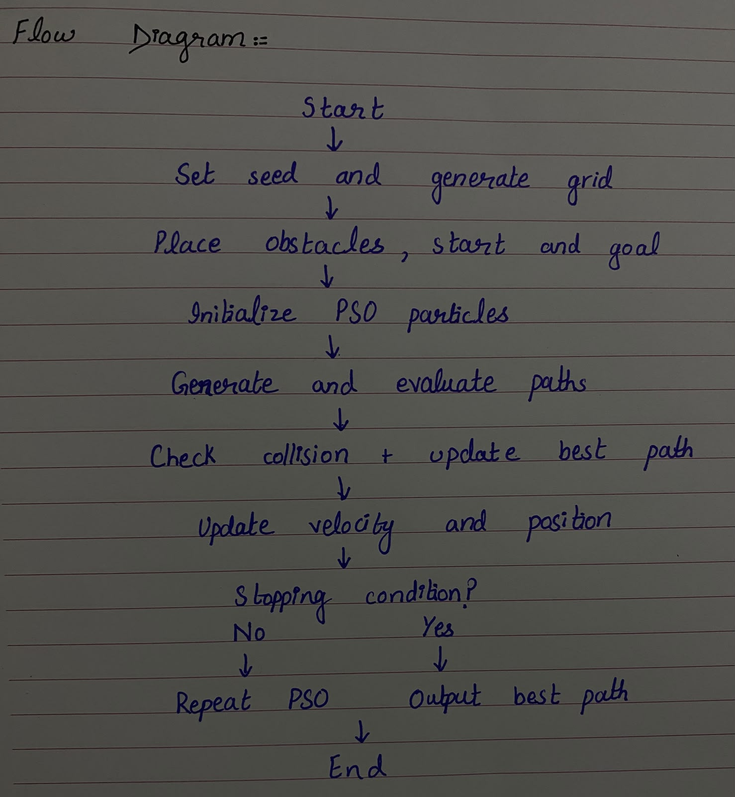

# PSO Path Planning

## Student Information

**Name:** Minahil Imran
**Roll Number:** 01-136232-070
**Random Seed:** 70

## Project Description

This project implements **Particle Swarm Optimization (PSO)** for path planning in a two-dimensional grid environment containing randomly generated obstacles.

The roll number **70** is used as the random seed so that the generated problem is reproducible. The algorithm generates a grid, places obstacles, selects a start and goal point, and then uses a swarm of particles to search for a short and collision-free path.

Each particle represents a possible path through a set of waypoints. The fitness function considers the total path length and penalizes paths that collide with obstacles. During optimization, particles update their positions based on their own best solution and the swarm's global best solution.

The final path is simplified by removing unnecessary waypoints while ensuring that the resulting path remains collision-free.

## Approach

The main steps of the algorithm are:

1. Set the random seed using the roll number.
2. Generate a random grid between 20 × 20 and 30 × 30.
3. Randomly place obstacles on the grid.
4. Select free cells for the start and goal points.
5. Initialize PSO particles around the direct path between start and goal.
6. Evaluate each particle using the fitness function.
7. Check whether candidate paths collide with obstacles.
8. Update particle velocity and position using PSO.
9. Update personal-best and global-best solutions.
10. Continue until the maximum number of iterations is reached.
11. Select the best collision-free path found.
12. Simplify the final path by removing unnecessary waypoints.
13. Visualize the final path and PSO convergence.

## Algorithm Flow Diagram

The following flow diagram shows the algorithm used for this project.

**A hand-drawn version of the flow diagram is included as a photograph in the repository, as required.**



## PSO Parameters

| Parameter             | Value |
| --------------------- | ----: |
| Random Seed           |    70 |
| Number of Particles   |    40 |
| Maximum Iterations    |   150 |
| Number of Waypoints   |     5 |
| Cognitive Coefficient |   1.6 |
| Social Coefficient    |   1.6 |
| Initial Inertia       |   0.9 |
| Final Inertia         |   0.4 |

## Generated Problem

Using seed **70**, the program generated the following problem:

| Parameter      |  Result |
| -------------- | ------: |
| Grid Size      | 21 × 21 |
| Obstacle Count |      61 |
| Start Point    | (8, 13) |
| Goal Point     |  (4, 5) |

## Final Result

The final optimized path contains four points:

```text
(8.00, 13.00)
(6.81, 11.43)
(4.50, 7.57)
(4.00, 5.00)
```

### Performance

| Result            | Value |
| ----------------- | ----: |
| Final Path Length |  9.09 |
| Collision Free    |  True |
| Final Path Points |     4 |

The resulting path successfully reaches the goal while avoiding the generated obstacles.

## Results and Visualization

The program generates two visualization files.

### Final Path

`results/path.png`

This graph shows the generated grid, obstacles, start point, goal point, and the final PSO path.

### PSO Convergence

`results/convergence.png`

This graph shows the best fitness value over the PSO iterations and demonstrates the optimization process.

## Project Structure

```text
PSO-Path-Planning-70/
│
├── pso_path_planning.py
├── README.md
├── flow_diagram.jpg
│
└── results/
    ├── path.png
    └── convergence.png
```

## Requirements

The project uses **Python 3.11**.

Required libraries:

* NumPy
* Matplotlib

Install them using:

```bash
pip install numpy matplotlib
```

## How to Run

Clone or download the repository and open a terminal in the project directory.

Run:

```bash
python pso_path_planning.py
```

The program will:

* Generate the grid and obstacles.
* Select the start and goal points.
* Run Particle Swarm Optimization.
* Find the best collision-free path.
* Simplify the final path.
* Display the path visualization.
* Display the convergence graph.
* Save the results inside the `results` folder.

## Reproducibility

The random seed is set to the student's roll number:

```python
ROLL_NUMBER = 70
```

Using the same seed produces the same generated grid, obstacle configuration, start point, and goal point.

## GitHub Repository and Commit History

The project was developed incrementally using multiple meaningful Git commits rather than uploading the complete project in a single commit.

The development process included:

1. Initial project setup.
2. Grid and obstacle generation.
3. PSO path-planning implementation.
4. Path-quality improvements and result verification.
5. Final project documentation and README.

This commit-based development history demonstrates the progressive development of the project.

## Conclusion

This project demonstrates the use of **Particle Swarm Optimization for two-dimensional path planning**.

Using roll number **70 as the random seed**, the algorithm generated a **21 × 21 grid with 61 obstacles** and successfully found a **collision-free path of length 9.09** from **(8, 13)** to **(4, 5)**.

The project also provides visualizations of the final path and PSO convergence and documents the complete algorithm and implementation process.
